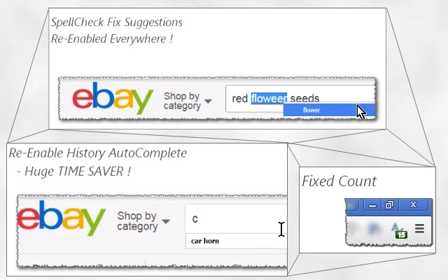

<h1>  Chrome-Extension-SpellCheck-AutoComplete-Enabler</h1>

- Chrome Spell-Check Is Great! 🌟︎
- Chrome Auto-Completing Is A Huge Time-Saver! 🕙︎



- ❓︎  So Why There Are Websites That Disable Those Wonderful Features?
- ❗︎  Don't Know, Don't Care!

💁︎
- Install This Extension, SpellCheck && AutoComplete Will Be Back!
- Works Perfectly With Every Website. 100% Compatible.
- Also Tells You How-Many \*Stuff\* Were Fixed  :]

<hr/>

###If You Like It, Show It, <a target="_blank" href="https://www.paypal.com/cgi-bin/webscr?cmd=_donations&amp;business=7994YX29444PA&amp;lc=US&amp;item_name=Elad%20Karako&amp;item_number=stackoverflow%2dcoffee%2dicon&amp;amount=0%2e50&amp;currency_code=USD&amp;bn=PP%2dDonationsBF%3abtn_donateCC_LG%2egif%3aNonHosted" rel="nofollow">By A Small Donation Using PayPal</a>. Thank You.

<hr/>

🚀︎
After Installation, User-Experience Of A Lot Of Websites Will Be Massivly-Improve,
With Enabled AutoComplete Menu, And Spell-Error Checking On Text-Input Elements Across The Whole Page!

<h3>☕︎ Some Examples</h3>
    - eBay:         main search bar (above), custom search page.
    - gmail:        main search bar (above), label searchbar (left), email-fields (address, title, body), ..more..
    - Amazon:       main search bar (above).
    - DealExtream:  main search bar (above).
    
    - much.. much.. more..☺
    
<h3>👔︎ Developer Hub</h3>
    - Feel Free To Request Support Or Open-Up A Bug Using the GitHub Section Above,
    - My Web-Blog At http://icompile.eladkarako.com
    - Or The Chrome-Extension Page :)

```
Developer's HUB / Changelog

3.0.1.7
* engine fix, for repetition-flag

3.0.1.4
* limit repetition by flag done-elements.

3.0.1.3
+ error handling

3.0.1.2
* adding prototyping for browser compatibility.

3.0.1.1
* tag-number updated instead of overriding it.

3.0.0.1
* project architecture, support execution on pages with and without JavaScript support, no code-duplication using the scope of the chrome-extension.

2.0.0.8
* engine run-state fine tuning.

2.0.0.5
- removing HTTP-headers-modifications and unneeded permissions.

2.0.0.4
+ initial (no versioning while product was in-alpha developing :| ).
```
